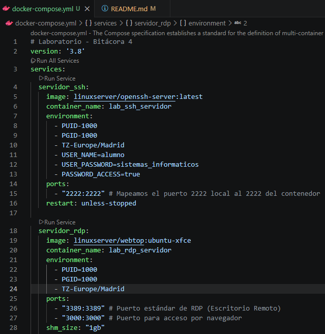
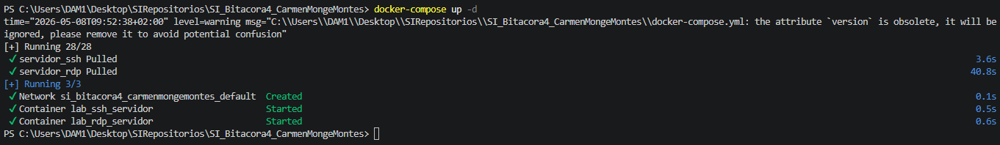

# SI_Bitacora4_CarmenMongeMontes 
## Tarea 1: Despliegue de la Infraestructura 
1. Creamos la carpeta SI_Bitacora4_CarmenMongeMontes 
2. Creamos el archivo docker-compose.yml que nos han proporcionado dentro de la carpeta 
 
3. Abrimos una terminal dentro de dicha carpeta y ejecutamos: **docker-compose up -d** 
 
4. Verificamos que el contenedor está corriendo en docker 
 
